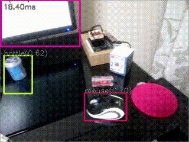
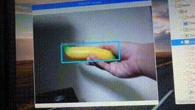

# Edge TPU samples.

## About
Coral Edge TPU samples (Python/C++, Raspberry Pi/Windows/Linux).
 - [Object detection by PiCamera or Video Capture.](detection)
 - [Image classifilcation by PiCamera or Video Capture.](classify)
 - [Object camouflage by PiCamera.](camouflage) 
 - [Semantic Segmentation using DeepLab v3.](deeplab)





## Environment
- Coral Edge TPU USB Accelerator
- Raspberry Pi (3 B+ / 4) + PiCamera or UVC Camera
- x64 PC(Windows or Linux) + Video file or UVC Camera
- Python3

## Installation
- OpenCV with OpenCV's extra modules(3.4.5 or higher)
- Edge TPU Python library [(Get started with the USB Accelerator)](https://coral.withgoogle.com/tutorials/accelerator/)

## Usage
Image classification:<br>
``` $ python3 ./object_detection_capture_picamera.py --model=<PATH_TO_edgetpu.tflite> --label=<PATH_TO_LABELS_TXT>```

Full command-line options:<br>
``` $ python3 ./xxxx.py -h```

## Reference
- [Get started with the USB Accelerator](https://coral.withgoogle.com/tutorials/accelerator/)
- [TensorFlow models on the Edge TPU](https://coral.withgoogle.com/tutorials/edgetpu-models-intro/#model-requirements)
- [Models Built for the Edge TPU](https://coral.withgoogle.com/models/)
